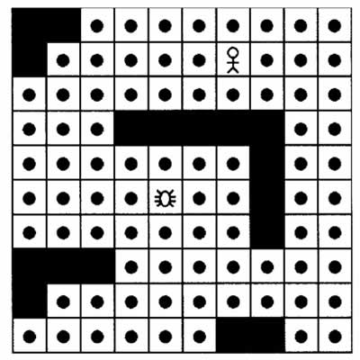

name: index
class: center, middle 

.master-title[
# 游戏AI中的A*算法
]

.mtl[

电信系互联网中心&nbsp;&nbsp;林寿山

2014-6-3

[http://raytaylorlin.com](http://raytaylorlin.com)
]

---

## 什么是路径寻找算法？

.img[

]

---

## 常见的路径寻找算法

* BFS（Breadth First Search，宽度优先搜索）
* Dijkstra算法
* **A*算法**

---

# A*算法

* 抽象-简化搜索区域
* 路径寻找算法
* 计算成本
* 影响力映射（动态成本）

---

## 抽象-简化搜索区域

我们需要以某种方式表示游戏世界，让搜寻算法能在特定的模型下搜寻，并找出最佳路径

“砖块”模型最适合使用A*算法



---

name: astar

## 路径寻找算法

A*算法要求给定地图、起点、终点三个要素。

```python
把起点加入openList
while openList不为空:
    当前节点 = openList中成本最低的点
    if 当前节点 == 目标节点:
        推导路径，搜索完成
    else:
        把当前节点加入closeList
        for v in 当前节点的每个相邻节点:
            if v不在openList and v不在closeList and v不是障碍物:
                把v加入openList
                计算v的成本
```

* openList：存放待检查的节点
* closeList：存放已经被检查过的节点（避免重复查找）
* 推导路径：只需给每个节点加上一个指向父节点的字段即可
* **计算成本：路径“最短”的依据**

---

## 计算成本

成本越小，说明路径越优

顶点n的成本：`f(n) = g(n) + h(n)`

* g(n)表示从起点到任意顶点n的实际距离
* h(n)表示任意顶点n到终点的**估算距离**

计算h(n)是*启发式（heuristic）的*，因为它只是一个猜测

最简单的启发式计算，是**曼哈顿方法**，即计算当前格到目标格之间*水平*和*垂直*方格的数量总和

[举例](#astar)

---

## 影响力映射（动态成本）

除了上述通过曼哈顿方法计算出来的“路径成本”之外，实际应用中还有“地形成本”等其他成本需要考虑。

上述的路径、地形等成本通常是游戏设计者直接编写进游戏世界里面的，属于“静态成本”。实际应用中还有不断发生变化的“动态成本”，这称为影响力映射（influence mapping），它会依据游戏里发生的情节而定。

例子：[受敌人火力网的影响](images/fire.jpg)、[受被杀害次数的影响](images/kill.jpg)

---

# 总结

今天我介绍了以下内容：

* 游戏中路径寻找的概念
* 常见的路径寻找算法
* A*算法的基本思路
* A*算法的核心：路径成本计算

---

# 参考

* [《游戏开发中的人工智能》](http://book.douban.com/subject/1899340/)
* [博文《A*算法详解》](http://blog.csdn.net/crayondeng/article/details/12342989)

---
class: center, middle

.master-title[
# Q & A
]

---
class: center, middle

.master-title[
## THANK YOU

# 游戏AI中的A*算法
]

.mtl[

电信系互联网中心&nbsp;&nbsp;林寿山

[http://raytaylorlin.com](http://raytaylorlin.com)
]

.small[
This slide is created by [remark.js](http://remarkjs.com/)
]