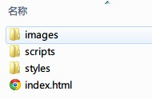

name: index
class: center, middle 

.left-top-title[
*寿寿前端系列讲座（4）*
]

.master-title[
# 前端自动化工作流简介
]

.mtl[

by 寿寿

[http://raytaylorlin.com](http://raytaylorlin.com)
]

---

background-image: url(http://fe-lecture-slides.qiniudn.com/fe-workflow-automation/%E5%89%8D%E7%AB%AF%E8%87%AA%E5%8A%A8%E5%8C%96%E5%B7%A5%E4%BD%9C%E6%B5%81%E7%AE%80%E4%BB%8B.png)

# 内容提要

---

# 引言

.mts[
### 什么是前端工作流？
]

简单来说，就是你完成前端开发的整个工作流程。

普通的程序开发工作流：创建，编码，测试

前端有其特殊性，所以会多很多步骤。

比如：切图，编码（HTML/CSS/Javascript），浏览器兼容测试，压缩代码，优化图片……

---

name: tradition

## 回顾：习以为常的传统做法

1、创建项目：新建各种文件夹（images、css、js等等），把原有项目中常用的库复制进来  
2、启动本地测试服务器（localhost），通常是WAMP环境  
<hr>
3、切图，编码页面（HTML+CSS）  
4、保存，打开/刷新**多个**浏览器，查看刚才编写的页面是否达到效果  
5、~~（如果你是一个正常的前端开发者）~~用DevTools试验/微调样式  
6、重复3-6，直到页面达到效果  
<hr>
7、编码交互和事件（Javascript）  
8、保存，打开/刷新浏览器，手动触发事件，查看是否达到效果  
9、~~（如果你是一个正常的前端开发者）~~用DevTools调试JS脚本  
10、重复7-10，直到页面达到效果  

---

## 回顾：习以为常的传统做法（续）

11、配合后端人员，填充真实数据，查看是否达到显示和逻辑效果  
12、重复3-12，直到达到效果  
13、重复上述3-13，完成下一个页面，再下一个页面……
<hr>
14、构建：开一个压缩工具（在线或线下的），压缩js和css文件，修改html中的引用文件路径  
15、部署：将整个项目打包，通过FTP或scp上传到服务器  
16、线上版本出bug，回到上面3……  
<hr>
17、项目后期，代码日渐庞大，越来越难维护。改bug或加功能都要小心翼翼，因为经常顾此失彼，改了这个地方其他地方又产生新的bug……（然后你就会逐渐开始对代码产生恐惧）

---

class: center, middle

**每增加一个切片都要改CSS**浪费了你多少时间？

**按F5刷新**浪费了你多少时间？

**按F5后等待页面加载完毕再测试**浪费了你多少时间？

**测试DOM操作**浪费了你多少时间？

**每次发布都要手动构建和部署代码**浪费了你多少时间？

.mtm[
### 如果你还在使用传统的方式做前端，那你就out了
]

---

## 解放你的生产力

.center.mtl[
### *计算机最擅长做繁琐而重复的事情，*  
### *何不把最麻烦的事交给它？*
]

.center.mtl[
### *花点精力配置，全部自动化，一劳永逸。*
]

---

# 基础知识

* Node.js简介
* Node的包与npm
* ~~Git与Github~~

---

## Node.js简介

.right[

]

* Node.js是一个基于Google V8这个高性能Javascript引擎的平台
* 使用的语言是Javascript（后台）
* 用来方便地搭建快速的、易于扩展的网络应用
* 特点：异步I/O，事件驱动，跨平台
* 社区活跃，各种包如雨后春笋般涌现

---

## 包与npm

Node中的包，实际上就是一个打包的`.zip`或.`.tar.gz`文件

每个包都有一个包描述文件：`package.json`

```json
{
  "name": "Heatmap3",
  "version": "0.3.0",
  "description": "Heatmap3",
  "repository": "",
  "author": "ELWG Heatmap3 Team",
  "devDependencies": {
    "grunt": "~0.4.2",
    "grunt-contrib-watch": "~0.5.3",
    "grunt-contrib-connect": "~0.5.0",
    "grunt-spritesmith": "~1.16.0",
    "grunt-spritesheet": "~0.1.2",
    "grunt-contrib-imagemin": "~0.4.0",
    "grunt-contrib-requirejs": "~0.4.1",
    "grunt-contrib-jshint": "~0.7.2",
    "grunt-contrib-csslint": "~0.1.2",
    "grunt-contrib-cssmin": "~0.7.0",
    "grunt-contrib-concat": "~0.3.0"
  }
}
```

---

## 包与npm（续）

Node包管理器[NPM](https://www.npmjs.org/)（随同Node.js一同安装）

最常用的几条npm命令：

```shell
npm install
npm install <package> [--save-dev]
npm install -g <package>
npm remove <package>
npm update <package>
```

---

## Git与Github

传统的版本控制系统是SVN，Git是新兴的分布式版本控制系统。

Github基于Git。它是目前最火的**开源代码托管平台**和**版本控制系统**。

.mtl[
*关于Git的使用及Github的机制，足以再开另外一次讲座，此处不再赘述。*
]

.mtl[
你们只需要知道：当今99%新生的和前端有关的项目、框架、插件，都是在Github上发布的。
]

---

# 打造自动化工作流

我们使用：


Yeoman是一款现代Web应用的脚手架工具，也是一个工作流。

Yeoman由3部分组成：Yo、Bower、Grunt

---

.pull-right[

]

## Yo——搭建脚手架

为什么要用工具搭建脚手架（建立项目目录结构）？

你们可能以为一个项目的目录结构是这样的：



不，是[这样](images/directory2.jpg)的（最基础的generator-webapp）

实际还有[更劲爆](images/directory3.jpg)的（generator-mean）

```shell
npm install -g yo
npm install -g generator-webapp
```

```shell
// 在你要创建项目的目录下
yo webapp
```

---

.pull-right[

]

## Bower——管理包

与NPM管理后台的包不同，Bower是用于Web前端开发的包管理器。它运行在Git之上（因此必须先安装Git），默认情况下会去Github下载，并存放在`bower_components`目录下。

为什么要用包管理器？

```shell
npm install -g bower
```

常用命令：

```shell
bower install jquery
bower install jquery#1.10.2
bower uninstall bootstrap
```

可以通过`.bowerrc`文件来对bower进行配置。可以在[这里](http://bower.io/search/)浏览和搜索你感兴趣的包。

---

.pull-right[

]

## Grunt——自动化

为什么要用Grunt？  
原因一：自动化。  
原因二：生态系统非常庞大，而且一直在增长。  
[回顾传统前端开发的痛苦之处](#tradition)

[Grunt快速入门](http://gruntjs.com/getting-started)

要使用Grunt，需要配置两个文件：`package.json`和`Gruntfile.js`。通常来说前者不需要手动配置，只要在`npm install`插件时，加上`--save dev`即可。

```json
{
    "name": "my-project-name",
    "version": "0.1.0",
    "devDependencies": {
        "grunt": "~0.4.1",
        "grunt-contrib-concat": "~0.3.0",
        "grunt-contrib-jshint": "~0.6.3",
        "grunt-contrib-uglify": "~0.2.2"
    }
}
```

---

## Grunt——自动化（续）

```javascript
// 1. wrapper函数，你的所有Grunt代码都必须写在这个函数里面
module.exports = function(grunt) {
    // 2. 项目和任务配置
    grunt.initConfig({
        pkg: grunt.file.readJSON('package.json'),
        concat: {
            options: {
                separator: '\n'
            },
            dist: {
                src: ['src/*.js'],
                dest: 'release/<%= pkg.name %>.js'
            }
        },
        uglify: {
            dist: {
                files: {
                    'release/<%= pkg.name %>.min.js': ['<%= concat.dist.dest %>']
                }
            }
        }
    });
    // 3. 加载各种任务所需的插件
    grunt.loadNpmTasks('grunt-contrib-concat');
    grunt.loadNpmTasks('grunt-contrib-uglify');
    // 4. 自定义任务
    grunt.registerTask('default', ['concat', 'uglify']);
};
```

---

## Grunt——自动化（续2）

理解Gruntfile的两个核心概念：**任务**和**目标**

### 常用的Grunt插件介绍

代码合并压缩类：  
grunt-contrib-concat，grunt-contrib-uglify，grunt-contrib-mincss，grunt-contrib-htmlmin，grunt-contrib-less，grunt-contrib-requirejs

代码检查类：  
grunt-contrib-jshint，grunt-contrib-csslint

任务控制类：  
grunt-contrib-watch，grunt-concurrent，grunt-nodeman

图片优化类：  
grunt-spritesmith，grunt-spritesheet，grunt-imagemin

测试类：  
grunt-karma，grunt-mocha-test

---

# 总结


---

# 参考


---
class: center, middle

.master-title[
# Q & A
]

---
class: center, middle

.master-title[
## THANK YOU

# 前端自动化工作流简介
]

.mtl[

by 寿寿

[http://raytaylorlin.com](http://raytaylorlin.com)
]

.small[
This slide is created by [remark.js](http://remarkjs.com/)
]