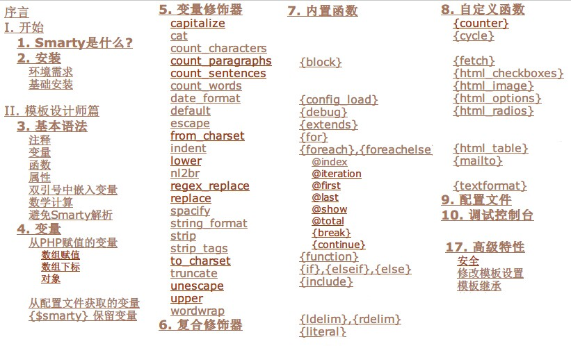

name: index
class: center, middle 

.left-top-title[
*寿寿前端系列讲座（5）*
]

.master-title[
# Smarty简介
]

.mtl[

by 寿寿

2014-7-16

[http://raytaylorlin.com](http://raytaylorlin.com)

]

---

# 引言

.mts[
### Smarty是什么？
]

Smarty是一个PHP的模板引擎

Smarty提供让程序逻辑与页面显示（HTML/CSS）代码分离的功能

官方网站：[http://www.smarty.net/](http://www.smarty.net/)

---

## 问题：PHP本身就是模板引擎？

HTML代码中内嵌PHP会使代码变得极度ugly。

[反例1](images/html-nested-php1.jpg)

程序逻辑和主页面混合，各种require错综复杂

[反例2](images/html-nexted-php2.jpg)

---

## Smarty哲学理念

* 干净，逻辑和显示分离
* 可读性强
* 模块化
* 快速和简单的维护
* 语法简单易懂，无须懂PHP
* 前端和后端人员更加专注

---

## 其他模板引擎

Smarty并非是唯一的遵循**分离显示逻辑和程序代码**的模板引擎

其他模板引擎：Django Templates(Python)、EJS(Javascript)

## Smarty的地位

* Smarty不是一个应用开发框架
* Smarty不是MVC
* Smarty只是一个模板引擎

---

# 特性介绍

* 概览
* 安装
* 注释
* 变量
* 修饰器
* 内置函数
* 模板继承

---

## Smarty概览

index.tpl模板代码：

```tpl
{include file="header.tpl"}

<h1>Welcome!</h1>

{if $logged_in}
    <p>Hello {$firstname} {$lastname}, glad to see you.</p>
{else}
    <p>Please <a href="login.php">login</p>
{/if}

{include file="footer.tpl"}
```

index.php代码：

```php
<?php
require_once('Smarty.class.php');
$smarty = new Smarty();
$smarty->assign('firstname', 'Ray');
$smarty->assign('lastname', 'Taylor');
$smarty->assgin('logged_in', $_SESSION['logged_in']);
$smarty->display('index.tpl');
?>
```

---

## Smarty概览（续）

渲染的HTML代码：

```html
<header></header>
<h1>Welcome!</h1>
<p>Hello Ray Taylor, glad to see you.</p>
<footer></footer>
```

---

## 安装

下载Smarty发行包后，将`libs/`文件夹复制到项目中（要求PHP5.2或更高）

```
Smarty-v.e.r/
   libs/
      Smarty.class.php
      debug.tpl
      sysplugins/* (everything)
      plugins/*    (everything)
```

关键是载入`Smarty.class.php`文件

详细安装方法参照[Smarty基础安装](http://www.smarty.net/docs/zh_CN/installing.smarty.basic.tpl)

与Code Igniter集成，参照[CodeIgniter+Smarty - Perfect Together](http://www.coolphptools.com/codeigniter-smarty)

---

## 注释

Smarty的标签都是使用定界符括起来，默认定界符是{ 和 }

```tpl
{* 我是一个Smarty单行注释，显示时我不会存在，感觉萌萌哒 *}
<!DOCTYPE html>
<html>
<head>
    <title>{$title}</title>
</head>
<body>
<!-- HTML 注释会发送到浏览器的哟 -->

{* 
    Smarty的多行
    注释
    不会发送到浏览器
 *}
</body>
</html>
```

---

## 变量

从数组赋值（最常用）

```php
<?php
$smarty->assign('contacts',
    array('name' => 'Ray Taylor',
          'email' => 'raytaylorlin@gmail.com',
          'phone' => array('home' => '555-444-3333',
                           'mobile' => '159********')
                           )
         );
$smarty->display('index.tpl');
?>
```

```tpl
{$contacts.name}<br />
{$contacts.email}<br />
{$contacts.phone.home}<br />
{$contacts.phone.cell}<br />
```

---

## 变量（续1）

从配置文件赋值（通过#号来访问）

ichangge.conf配置文件：

```conf
title = "爱唱歌3.0"
description = "校园音乐平台爱唱歌3.0"
keywords = "爱唱歌, 唱歌, 校园音乐平台"
```

```tpl
{config_load file="ichangge.conf"}
<head>
    <title>{#title#}</title>
    <meta name="description" content="{#description#}">
    <meta name="keywords" content="{#keywords#}">
</head>
```

---

## 变量（续2）

$smarty保留变量

```tpl
{* 相当于$_GET['PAGE'] *}
<div>第{$smarty.get.page}页</div>

{* 相当于$_COOKIE['username'] *}
<p>当前用户：{$smarty.cookies.username}</p>

{* 编译当前模板的Smarty版本 *}
<div id="footer">由 Smarty {$smarty.version} 引擎驱动</div>

{* define('MY_CONST_VAL','IChangge'); *}
{$smarty.const.MY_CONST_VAL}
```

**直接访问超全局变量或者PHP常量会弄乱应用程序底层代码和模板语法。 最佳的实践是从PHP将需要的变量对模板进行赋值再使用。**

---

## 修饰器

* 修饰器可以用于变量、自定义函数或者字符串，类似于管道
* 使用`|`竖线跟着修饰器名称，可能会用`:`冒号附加参数
* 修饰器可以被**级联使用**

```tpl
{* 设定默认值，取代了PHP冗长的isset判断 *}
<div>标题：{$myTitle|default:'no title'}</div>

{* 转换为指定的时间格式 *}
<p>日期：{$smarty.now|date_format:"%Y/%m/%d"}</p>

{* 截取75个字符，用...表示，按单词截取 *}
{$content|truncate:75:"...":true}

{* 将变量值中的"\n"回车全部转换成HTML的 <br /> *}
{$content|nl2br}

{* 先转换为小写，再截取30个字符，再在每个字符之间插入空格 *}
{$articleTitle|lower|truncate:30|spacify}
```

---

## 内置函数

{if}, {elseif}, {else}

```tpl
{if if (count($structInfo) == 0)}
    <div>三大应用中暂无话题数据</div>
{else}
    <table class="tab"></table>
{/if}
```

{foreach} {foreachelse}

```tpl
<ul>
{foreach $peopleList as $key => $value}
    <li>{$key}: {$value}</li>
{foreachelse}
    <li>no items...</li>
{/foreach}
</ul>
```

---

## 内置函数（续）

{foreach} @iteration @first @last @total

```tpl
{foreach $peopleList as $person}
    <tr class="{if $person@iteration is odd} odd {/if}">
        <td>{key@iteration}</td>
        <td>{$person.name}</td>
    </tr>

    {if $item@last}
        <div class="total">{$item@total} items</div>
    {/if}
{/foreach}
```

{include}（实现模块化）

```tpl
{include "page_header.tpl"}
{include "contacts.tpl" title="通讯录" contacts=$contacts_list}
{include "$footer_name.tpl"}
```

---

# 模板继承

问题：**，如何减少共用页面所引起的重复和冗余代码？**

解决方法1：传统的`require`（`require_once`）  
或者刚刚学的{include}指令

解决方法2：更加优雅的策略——模板继承

传统做法：

[board_present.php](images/board_present_php.jpg)

[room_present.php](images/room_present_php.jpg)

---

## 潜在问题

1. 如果一个网站有10个页面怎么办？
2. 如果我要修改doctype以支持低端浏览器怎么办？
3. 基于include策略，拆分HTML各个部分？

header.html

```html
<!DOCTYPE HTML PUBLIC "-//W3C//DTD HTML 4.01//EN">
<html lang="en">
<head>
```

footer.html

```html
</body>
</html>
```

Too ugly！而且极其容易少写闭合标签！

---

## 父模板

定义父模板（抽象公共特征）

base.tpl

```tpl
<!DOCTYPE html>
<html>
<head>
    <title>{block name="title"}IChangge 3.0{/block}</title>
    {block name="head"}{/block}
</head>
<body>
{block name="body"}{/block}
{block name="javascript"}
    <script src="/js/common.js"></script>
{/block}
</body>
</html>
```

---

## 子模板

子模板继承并扩展

index.tpl

```tpl
{extends file="base.tpl"}  {* 第一句必须是extends *}

{* 没有{block name="title"}，用默认的标题 *}

{* 覆盖父模板 *}
{block name="head"}
    <link href="/css/index.css" rel="stylesheet" type="text/css"/>
{/block}
{block name="body"}
    {* index的本体 *}
{/block}

{* 使用父模板的内容 *}
{block name="javascript"}
    {$smarty.block.parent}
    <script src="/js/index.js"></script>
{/block}
```

---

# 总结

* Smarty的哲学理念
* Smarty的基本语法
* 模板继承

---

# 参考

[Smarty3手册](http://www.smarty.net/docs/zh_CN/)



---
class: center, middle

.master-title[
# Q & A
]

---
class: center, middle

.master-title[
## THANK YOU

# Smarty简介
]

.mtl[

by 寿寿

[http://raytaylorlin.com](http://raytaylorlin.com)
]

.small[
This slide is created by [remark.js](http://remarkjs.com/)
]